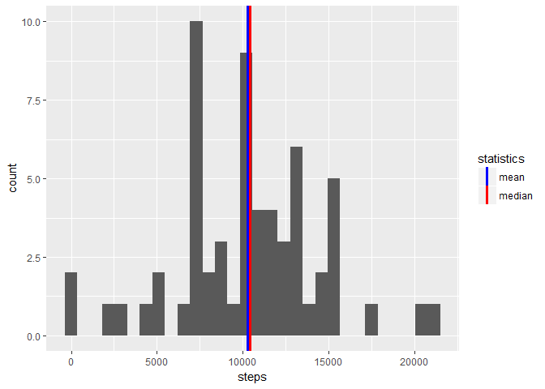

# Reproducible Research: Peer Assessment 1


---
title: "Reproducible Research: Peer Assessment 1"
output: 
  html_document:
    keep_md: true
---

# Course Project 1

## Loading and preprocessing the data

First the data is load and treated


```r
library(dplyr)
library(lubridate)
library(ggplot2)
data<-read.csv("activity.csv")

data <-data %>%
        mutate(steps=steps,
               time=as.POSIXct(
                       ymd(as.character(date))+minutes(interval)))
```


## What is mean total number of steps taken per day?

Then, mean and median of the daily sum are calculated. NAs are disconsidered.


```r
daily<-data%>%
        group_by(date)%>%
        summarize(steps=sum(steps, na.rm=T))


dailymean<-mean(daily$steps)
dailymedian<-median(daily$steps)

p<-ggplot(data=daily)
p+geom_histogram(aes(steps))+
        geom_vline(aes(xintercept=dailymedian,color='median') ,size=1.1) +
        geom_vline(aes(xintercept=dailymean,color='mean'),size=1.1)+
        scale_color_manual(name = "statistics",
                           values = c(median = "red", mean = "blue"))
```

```
## `stat_bin()` using `bins = 30`. Pick better value with `binwidth`.
```

<!-- -->

The mean is 9354.2295082 and the median is 10395 

## What is the average daily activity pattern?


Then, a plot of the timeseries of the avarage value for each interval is calculated
and the timeseries for an avarage day is plotted.


```r
avarageday<-data%>%
        group_by(interval)%>%
        summarize(steps=mean(steps, na.rm=T))


maximum<-data$interval[which(avarageday$steps==max(avarageday$steps))]

p<-ggplot(data=avarageday,aes(interval,steps))
p+ geom_line() 
```

<!-- -->

The interval with more steps is the one starting at 835 minutes.


## Imputing missing values

Then, mean and median of the daily sum are calculated. NAs values weree substituted 
for the values of an avarage day.


```r
totNAs<-sum(is.na(data$steps))

data2<-data%>%mutate(steps=ifelse(is.na(steps),round(
        avarageday$steps[interval/5+1]),steps))

daily<-data2%>%
        group_by(date)%>%
        summarize(steps=sum(steps, na.rm=T))


dailymean<-mean(daily$steps)
dailymedian<-median(daily$steps)

p<-ggplot(data=daily)
p+geom_histogram(aes(steps))+
        geom_vline(aes(xintercept=dailymedian,color='median') ,size=1.1) +
        geom_vline(aes(xintercept=dailymean,color='mean'),size=1.1)+
        scale_color_manual(name = "statistics",
                           values = c(median = "red", mean = "blue"))
```

```
## `stat_bin()` using `bins = 30`. Pick better value with `binwidth`.
```

<!-- -->

The mean is 1.0281836\times 10^{4} and the median is 1.0395\times 10^{4}. Considerably bigger than in
the previous exercise.


## Are there differences in activity patterns between weekdays and weekends?

Then, the data is stratified into weekends and weekdays. And timeseries are ploted for these 
two cases. It can be verified very different patterns


```r
library(chron)
```

```
## Warning: package 'chron' was built under R version 3.4.4
```

```
## 
## Attaching package: 'chron'
```

```
## The following objects are masked from 'package:lubridate':
## 
##     days, hours, minutes, seconds, years
```

```r
data<-data %>%
        mutate(weekend=is.weekend(time))

avarageday<-data%>%
        group_by(interval,weekend)%>%
        summarize(steps=mean(steps, na.rm=T))

p<-ggplot(data=avarageday,aes(interval,steps))
p+ geom_line()+facet_grid(weekend~.)
```

<!-- -->
